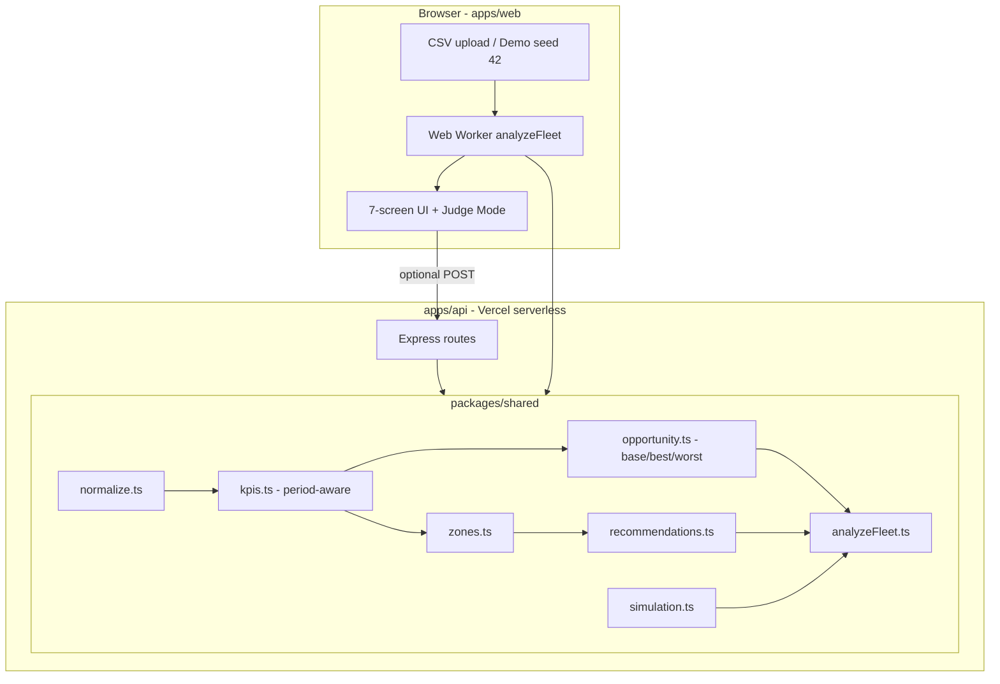

# Architecture — FleetRevenue AI

## Overview

FleetRevenue AI uses a **hybrid architecture**: the browser runs the full analytics pipeline offline for demos, while the Vercel-deployed API exposes the same engine for server-side analysis.



## Key design decisions

### Single analytics engine

All KPI, zone, recommendation, and opportunity math lives in `@fleet/shared`. The API and browser import identical functions — parity tested in `packages/shared/test/parity.test.ts`.

### Offline-first demo

`generateDemoFleet(42)` produces 500 rides + 150 leads deterministically. `runAnalysisAsync` delegates to a Web Worker so the UI stays responsive. No network required for the demo path.

### LLM-ready, not LLM-used

Recommendations are **rule-based** (zone imbalance, lead SLA, peak pricing). The architecture supports swapping in an LLM narrative layer later without changing KPI contracts.

### Breaking contract: AnalysisResponse

```typescript
AnalysisResponse {
  period: PeriodContext          // periodDays, label, monthlyRunRateEur
  opportunity: OpportunityProjection  // base/best/worst/annual + assumptions
  kpis, zones, charts, recommendations, executiveBrief, whyExplanation
}
```

Removed: `monthlyOpportunityEur` (single inflated headline).

## Privacy boundaries

| Data | Demo mode | API mode |
|------|-----------|----------|
| CSV contents | Stays in browser memory | Sent in POST body to same-origin API |
| Analysis results | Not persisted (no localStorage KPIs) | Returned in response, not stored |
| External services | None | None |
| LLM / third-party | None | None |

## Deployment (Vercel)

| Layer | Path | Output |
|-------|------|--------|
| Web SPA | `apps/web` | Static files + HTML fallback |
| API | `api/index.ts` | Serverless Express wrapper |
| Shared | `packages/shared` | Built to `dist/`, bundled by web/api |

`vercel.json` routes `/api/*` and `/health` to the serverless function; all other paths serve the SPA.

## Test layers

| Layer | Command | Count |
|-------|---------|-------|
| Shared unit | `npm run test -w packages/shared` | ~23 |
| API unit | `npm run test -w apps/api` | ~8 |
| Web unit | `npm run test -w apps/web` | ~14 |
| E2E | `npm run test:e2e` | 4 flows |
| Smoke | `npm run verify:smoke` | typecheck + build all |

## File map

```
packages/shared/src/analytics/
  period.ts       inferPeriodDaysFromRides, buildPeriodContext
  kpis.ts         revenue, utilization (vehicle-day based), leakage
  zones.ts        demand/supply, revenueOpportunity
  opportunity.ts  de-duplicated base/best/worst projection
  recommendations.ts  rule-based action generation
  simulation.ts   multi-action capped projections
  analyzeFleet.ts orchestrator

apps/web/src/
  app/mountApp.ts   state machine + event wiring
  screens/          Landing → Command → Map → Recs → Sim → Brief
  screens/JudgeModePanel.ts  judge Q&A accordion
```
